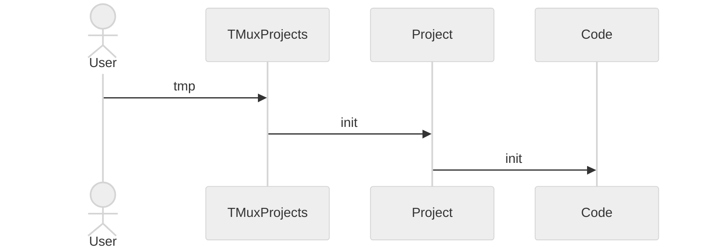
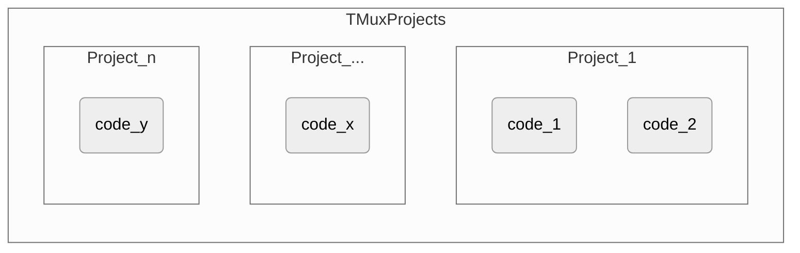

# TMux Projects (Bash/ZSH)

`git clone git@github.com:rnie85/TMP.git $HOME/projects`

For most projects I started or worked on, I was setting up a similar tree/file structure.
One that contained the project itself and some extended functionality I use when developing.

I wanted to use the same commands for all projects.
Like: `cdp` to `cd` into the project folder.
This meant that `cdp` should be aware of which project I'm working on.

Every project is a stand-alone part. By sourcing `. envrc` a project is initialized.
Doing this every time I open a terminal was tedious, but it worked.

This is where the idea came to create some functions to do the work for me, like create and initialize a project.
Eventually it got extended with backup functions and use of TMux sessions.

Basically, TMuxProjects handles Projects. Projects handles "code".
When the user chooses a project to initialize, TMuxProjects will `cd` to the project directory and sources `envrc`. In turn the Project will `cd` into the code directory and sources `envrc`.



TMuxProjects layout



## Example project tree

```text
+-- projects
|   +-- .projects/
|   +-- [ProjectNumberOne]
|   |   +-- .env/
|   |   |   +-- aliases.sh
|   |   |   +-- exports.sh
|   |   |   +-- functions.sh
|   |   |   +-- main.sh
|   |   +-- code/
|   |   |   +-- projectOne/    (actual (git...) project)
|   |   |       +-- .env/
|   |   |       |   +-- bin/
|   |   |       +-- envrc
|   |   +-- doc/
|   |   +-- notes/
|   |   +-- bookmarks
|   |   +-- contacts
|   |   +-- envrc
|   |   +-- README.md
|   +-- [ProjectNumberTwo]
|       +-- .env/
|       |   +-- aliases.sh
|       |   +-- exports.sh
|       |   +-- functions.sh
|       |   +-- main.sh
|       +-- code/
|       |   +-- projectTwo/    (actual (git...) project)
|       |       +-- .env/
|       |       |   +-- bin/
|       |       +-- envrc
|       +-- doc/
|       +-- notes/
|       +-- bookmarks
|       +-- contacts
|       +-- envrc
|       +-- README.md
+-- projects_backup
  +-- 20230414/
      +-- project_ProjectNumberOne_144532.tar.gz
```

## Load projects

To use TMux Projects, one file should be sourced.
This line should be added to the end of your `.zshrc` and/or `.bashrc` configuration file.

.bashrc

```bash
. PATH_TO_PROJECTS/source_me.sh
```

.zshrc

```sh
. PATH_TO_PROJECTS/source_me.zsh
```

## Commands

Available commands to work with projects.

There are 2 environment variables:

1. `TMP_PROJECTS` holds the path to the projects. (default: `$HOME/projects`)
2. `TMP_PROJECTS_BACKUP` holds the path to the projects backup folder. (default: `$HOME/projects_backup`)

### create-project

`create-project` (Will ask for a name)  
`create-project [PROJECT_NAME]`

* Creates a new project folder under `$TMP_PROJECTS` with `PROJECT_NAME` as folder name.
* Creates folders into the project. (`code`, `notes`, `doc` and `.env`)
* Creates files into the project. (`README.md`, `contacts`, `bookmarks`)
* Copies template files in `.env/` that are to be sourced when the project is initialized. (`main.sh`, `exports.sh`, `aliases.sh`, `functions.sh`) and `envrc` in the root of the project as start point.

### delete-project

`delete-project` (Shows a list of projects to delete)

* Creates a backup of the project to `$TMP_PROJECTS_BACKUP` folder.
* Removes the project from the `$TMP_PROJECTS` folder.

### init-project

`init-project` (Shows a list of projects)  
`init-project [PROJECT_NAME]`  
`init-project [PROJECT_NAME] [SKIP_PS1_CHANGE]`

* Initializes the project by sourcing the chosen project `envrc`.
* [optionally] Modifies the PS1 line to include the project name (usually when not using TMux, to make clear which project is active).

### init-tmux-project (aliased to tmp)

`init-tmux-project` (Shows a list of projects)  
`init-tmux-project [PROJECT_NAME]`  
`tmp` (alias to `init-tmux-project`) (Shows a list of projects)

* Create a TMux project session, or
* Create, share or attach a TMux project session if there are sessions already running.

### backup-project

`backup-project` (Shows a list of projects)

* Creates a backup of the whole project. (`$TMP_PROJECTS/projectName`)
* To `${TMP_PROJECTS_BACKUP}/DATE/project_PROJECT_NAME_TIME.tar.gz`

### backup-project-code

`backup-project-code` (Shows a list of projects)

* Creates a backup of the `code` folder of a project. (`$TMP_PROJECTS/projectName/code`)
* To `${TMP_PROJECTS_BACKUP}/DATE/PROJECT_NAME_TIME.tar.gz`

### backup-all-projects

`backup-all-projects`

* Creates a backup of all projects. (`$TMP_PROJECTS`)
* To `${TMP_PROJECTS_BACKUP}/DATE/all_projects_TIME.tar.gz`

### Auto load project if `PROJECT_NAME` is set

When sourcing the `source_me.(z)sh`, `__init-project-if-project-name-is-set` function is called.
This function checks if `$PROJECT_NAME` is set.
If so, it will call `init-project` with the project name.

In TMux when a new window or pane is created, it will initialize te current active project.

When a project is initialized, and from that command line a new console is opened. It automatically initializes the active project.

## Template files

Some default files used for every project. These files are stored at `.projects/templates`
These files tend to have aliases, functions and/or exports that are not part of the GitHub/GitLab/... project. But are convenient to use while developing and often personal preference.

### main.sh

Everything not being a export, alias or function. Like: bash/zsh settings or behavior.

### exports.sh

In case additional project specific exports are needed.

### aliases.sh

Navigate to project folders.

```bash
alias reloadp # reload project environment

alias cdp     # go to project (${PROJECT_PATH})
alias cdc     # go to project code (${PROJECT_PATH}/code)
alias cdpp    # go to project (${PROJECT_PATH}/code/{PROJECT])
alias cdd     # go to project documents (${PROJECT_PATH}/doc)
alias cdn     # go to project notes (${PROJECT_PATH}/notes)
alias cde     # go to project .env (${PROJECT_PATH}/.env)
alias showlinks # print bookmarks
alias showcontactinfo # print contact information
```

### functions.sh

Following tools need to be available in order to use the available functions.

* [fdfind](https://github.com/sharkdp/fd)
* [ripgrep](https://github.com/BurntSushi/ripgrep)

At this point some search functions are defined:

| Command | Name              | Action                             |
| ------- | ----------------- | ---------------------------------- |
| `fdp`   | FDfindProject     | Find file in most project folders (ignores binary and hidden files and files ignored by your `.gitignore`) |
| `fdpa`  | FDfindProjectAll  | Find file in all project folders   |
| `rgp`   | RipGrepProject    | Find in file in most project files (skips binary files and files ignored by your `.gitignore`/`.ignore`/`rgignore`) |
| `rgpa`  | RipGrepProjectAll | Find in file in all project files  |

## TMux configuration

Do not add `PROJECT_NAME` or `PROJECT_PATH` to `update-environment` of TMux.

I'm using `-e` option which is available since TMux version 3.2.

Previously I set an environment variable before starting TMux, in combination with `PROJECT_NAME` or `PROJECT_PATH` added to `update-environment`.
This sometimes led to unwanted behavior. When reattaching it would update `PROJECT_NAME` and `PROJECT_PATH` if they where modified.
This was only noticeable when creating new windows or panes, they would suddenly have other values. The already open panes would still hold their initial value.
This had to do with TMux global and local environment variables.

The problem with tmux is that when you first run it, the tmux server is created and it inherits the environment that is available at this time of creation.
This is called the **global environment**. When you run tmux again and create a new session, the tmux server still uses its initial environment.
This means that even if you change an environment variable before calling TMux, the new session will have the environment value known in the global environment. **Not** the modified environment variable. The `-e` option fixed this behavior.

About the tmux commands that work with the tmux environment:

* `set update-environment MY_VAR`: this will tell tmux to take the `MY_VAR` variable from the `global environment` and make it a `local environment` (listed by the `show-environment` command). Mostly this is used for the `DISPLAY` and `SSH_...` environment variables as they are subject to change. (still the *new* value is available in new windows or panes. Already open panes need a manual step to update the value.)
* `set-environment MY_VAR value`: This will create (or change) a variable in the local environment of the session.
* `set-environment -g MY_VAR value`: This will create (or change) a variable in the global environment.

There are quite some questions and articles on this TMux environment behavior.

* [Environment problem](https://unix.stackexchange.com/questions/687543/global-and-session-environment-for-the-first-session-and-following)
* [renew environment](https://babushk.in/posts/renew-environment-tmux.html)
* [update environment](https://raimue.blog/2013/01/30/tmux-update-environment/)

## envrc for a project

I use a script that I put in the root of a (GitHub/GitLab/...) repository.

It initializes the name (`$PROJECT_NAME` if not set ) and path (`$PROJECT_ROOT`) of a project. These environment variables are used by scripts to make them independent of project location.

`${PROJECT_ROOT}/.env/bin` is added to the `$PATH` variable to call scripts on the command line.
When using the same script names on different projects, makes it easy to remember often used actions, such as:

* build (eg: make)
* clean (eg: make clean)
* fullclean / realclean (force remove build folder)
* utest (run unit tests)
* flash (flash a target)
* reset (reset a target)
* code (start VSCode)

An additional benefit with this setup is. When setting up a Docker environment or a pipeline, these commands are also available.

```bash
#!/bin/sh
#------------------------------------//
# Projects envrc
#------------------------------------//

if [ ! -e "./envrc" ]; then
    echo "'cd' into the 'envrc' scripts directory before sourcing"
    return 1
fi

export PROJECT_ROOT=${PWD}
[ -z "${PROJECT_NAME}" ] && export PROJECT_NAME=${PWD##*/}

echo "loading ${PROJECT_NAME} .envrc"
echo

export PATH="${PROJECT_ROOT}/.env/bin:${PATH}"

echo "Poject Name:    $PROJECT_NAME"
echo "Project Root:   $PROJECT_ROOT"
echo "PATH            $PATH"
echo
```
