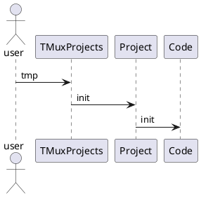
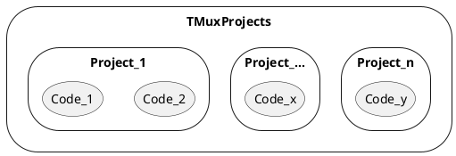

# Good 2 know

Document changes made to this repo and why.
:smile:

## Previous script (pre 15-05-2023)

In the past `$0` was used to locate the script location.
I found that while using docker, `$0` sometimes is not what is expected.
It returned `sh`, `/bin/sh` or `bash` instead of the expected script name `./envrc`. That is why `$DOCKER` and `$BITBUCKET_WORKSPACE` are checked to fix the problem.
To get rid of `$0` altogether, force the user to `cd` into the directory before sourcing the file. This made the script simpler and more portable.

```bash
#!/bin/sh
#------------------------------------//
# Projects .envrc
#------------------------------------//

echo "loading ${PROJECT_NAME} .envrc"

script_path="${0}"

# Docker often uses sh or busybox which does not give a correct $0 value.
# Expected is when sourcing to return the path of this script.

# Inside the Docker container, `project` is mounted at a known location using Docker volumes.
PROJECT_LOCATION="project"
if [ -n "${DOCKER}" ]; then
  echo "Running in Docker"
  script_path="/${PROJECT_LOCATION}/.envrc"
fi

# When using Bitbucket pipelines, the project is mounted at a predefined location
if [ -n "${BITBUCKET_WORKSPACE}" ]; then
  echo "Running in Bitbucket Pipeline Docker"
  script_path="/opt/atlassian/pipelines/agent/build/.envrc"
fi

envrc_path=$(realpath "${script_path}")
export PROJECT_ROOT="${envrc_path%/*}"
export PATH="${PROJECT_ROOT}/.env/bin:${PATH}"

echo "0:              $0"
echo "script_path:    $script_path"
echo "PATH            $PATH"
echo "Poject Name:    $PROJECT_NAME" # When only this file is sourced, `PROJECT_NAME` is not set.
echo "Project Root:   $PROJECT_ROOT"
echo
```

## PlantUML





## Styling

> __Note__
> Here is a note!

...

> __Warning__
> Here is a warning!

$${\color{red}Welcome \space \color{lightblue}To \space \color{orange}Github}$$

$\textcolor{green}{This\ is\ text}$
${This\ is\ a\ {\color{red}Big}}\ Title$


<red>red</red>

<style>
red { color: red }
yellow { color: yellow }
</style>